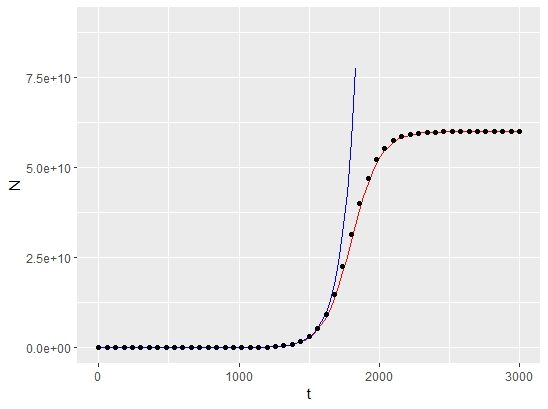

# Reproducible research: version control and R
Logistic growth curve modeling
# Section 1.2 
Questions 1-3 will be answered on the README.md
# Question 1: 
The purpose of this exercise is to estimate the initial population size, rate of growth, and carrying capacity of bacteria from experimental data. A logistic curve was used to approximate the bacterial growth from experimental data. To find N0 (initial population), K (carrying capacity), and r (per capita growth rate), a linear approximation was used. By analyzing the curve in two distinct regions, the variables in question can be determined. While t (time in min) is small, in this case less than 1800 minutes, the growth is exponential. A simple transformation using natural logs will yeild a linear relationship between N (population) and r (per capita growth rate). By solving for that equation, the intercept will be N0 (initial population) and the slope will be r (per capita growth rate). 
While t (time in min) is large, in this case when the growth plateaus at around 2500 minutes, the growth rate is close to 0
Thus, a very simple equation derives K (carrying capacity): N(t) = K 
The resulting values found are N0 = 1,044 r = 0.009902 K = 6e+10 for experiment1.csv 
# Question 2: 
To calculate this, the simplified exponential growth equation N(t) = N0(e)^rt will be used. Thus N(t) when t = 4980 N(4980) = 2.72e+24. The population calculated with the logistic growth model will instead yeild the value N(4980) = 6e+10. The massive descrepency is due to the plateau of growth from logistic growth model. Exponential growth only occurs, in the case of experiment1, for values of t (time in min) less than 1800. The value 1800 is the estimated inflection point of the logistic curve. The  inflection point was estimated from finding where the second derivative of the logistic function is equal to 0. After reaching the inflection point, population no longer increases exponentially. Instead, the growth rate decreases as the population reaches K (carrying capacity). Mathematically, effect of the carrying capacity can be expressed using limits (L' Hopital's rule). The resulting equation will yield: as t -> ∞, N(t) = K. Whereas for the exponential equation, growth will be infinite. 
# Question 3: 

